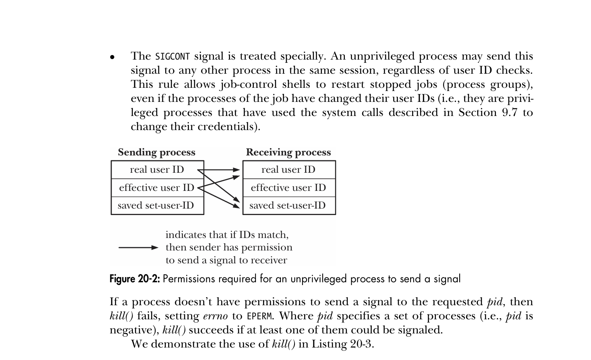

#+TITLE: Signals
#+AUTHOR: Astar Bahouidi
#+DESCRIPTION: Chapters 20-22 The Linux Programming Interface by Michael Kerrisk
#+STARTUP: showall

* Table Of Contents                                                   :toc_2:
- [[#20-fundamental-concepts][20 FUNDAMENTAL CONCEPTS]]
  - [[#203-changing-signal-dispositions-signal][20.3 Changing Signal Dispositions: signal()]]
  - [[#204-introduction-to-signal-handlers][20.4 Introduction to Signal Handlers]]
  - [[#205-sending-signals][20.5 Sending Signals]]
  - [[#208-displaying-signal-descriptions][20.8 Displaying Signal Descriptions]]
  - [[#209-signal-sets][20.9 Signal Sets]]
  - [[#2010-the-signal-mask-blocking-signal-delivery][20.10 The Signal Mask (Blocking Signal Delivery)]]
  - [[#2011-pending-signals][20.11 Pending Signals]]
  - [[#2012-signals-are-not-queued][20.12 Signals Are Not Queued]]
  - [[#2013-changing-signal-dispositions][20.13 Changing Signal Dispositions]]
  - [[#2014-waiting-for-a-signal][20.14 Waiting for a Signal]]
  - [[#2016-exercises][20.16 Exercises]]
- [[#21-signal-handlers][21 SIGNAL HANDLERS]]
  - [[#211-designing-signal-handlers][21.1 Designing Signal Handlers]]
  - [[#212-other-methods-of-terminating-a-signal-handler][21.2 Other Methods of Terminating a Signal Handler]]
  - [[#213-handling-a-signal-on-an-alternate-stack-sigaltstack][21.3 Handling a Signal on an Alternate Stack: sigaltstack()]]
  - [[#217-exercises][21.7 Exercises]]

* 20 FUNDAMENTAL CONCEPTS
** 20.3 Changing Signal Dispositions: signal()

The =signal()= system call, which is described in this section, was
the original API for setting the disposition of a signal, and it
provides a simpler interface than =sigaction()=. On the other hand,
=sigaction()= provides functionality that is not available with
=signal()=. Furthermore, there are variations in the behavior of
=signal()= across UNIX implementations (Section 22.7), which mean that
it should never be used for establishing signal handlers in portable
programs. Because of these portability issues, =sigaction()= is *the
(strongly) preferred API* for establishing a signal handler. After we
explain the use of =sigaction()= in Section 20.13, we’ll always employ
that call when establishing signal handlers in our example programs.

#+begin_src C
  #include <signal.h>

  void ( *signal(int sig, void (*handler)(int)) ) (int);
  /* Returns previous signal disposition on success, or SIG_ERR on error */
#+end_src

*** Handler prototype
Thus, a signal handler has the following general form:

#+begin_src C
  void handler(int sig) {
    /* Code for the handler */
  }
#+end_src

*** Using signal() returned handler
We could write code such as the following to temporarily establish a
handler for a signal, and then reset the disposition of the signal to
whatever it was previously:

#+begin_src C
  void (*oldHandler)(int);

  oldHandler = signal(SIGINT, newHandler);
  if (oldHandler == SIG_ERR)
    errExit("signal");

  /* Do something else here. During this time, if SIGINT is
     delivered, newHandler will be used to handle the signal. */

  if (signal(SIGINT, oldHandler) == SIG_ERR)
    errExit("signal");

#+end_src

It is not possible to use =signal()= to retrieve the current
disposition of a signal without at the same time changing that
disposition. To do that, we must use =sigaction()=.

*** Handler type
We can make the prototype for =signal()= much more comprehensible by
using the following type definition for a pointer to a signal handler
function:

#+begin_src C
  typedef void (*sighandler_t)(int);
#+end_src

This enables us to rewrite the prototype for =signal()= as follows:

#+begin_src C
  sighandler_t signal(int sig, sighandler_t handler);
#+end_src

If the =_GNU_SOURCE= feature test macro is defined, then glibc exposes
the nonstandard =sighandler_t= data type in the =<signal.h>= header
file.

*** Other possible second arguments
Instead of specifying the address of a function as the handler
argument of =signal()=, we can specify one of the following values:

- =SIG_DFL= Reset the disposition of the signal to its default (Table
  20-1). This is useful for undoing the effect of an earlier call to
  signal() that changed the disposition for the signal.

- =SIG_IGN= Ignore the signal. If the signal is generated for this
  process, the kernel silently discards it. The process never even
  knows that the signal occurred.

*** Summary
A successful call to =signal()= returns the previous disposition of
the signal, which may be the address of a previously installed handler
function, or one of the constants =SIG_DFL= or =SIG_IGN=. On error,
=signal()= returns the value =SIG_ERR=.

** 20.4 Introduction to Signal Handlers

- [[file:ouch.c][Listing 20.1 ouch]]: Installing a handler for SIGINT.
- [[file:youch.c][youch]]: practice.
- [[file:intquit.c][Listing 20.2 intquit]]: Establishing the same handler for two
  different signals.
- [[file:yintquit.c][yintquit]]: Practice.
  
** 20.5 Sending Signals

*** The kill() system call

#+begin_src C
  #include <signal.h>

  int kill(pid_t pid, int sig);
  /* Returns 0 on success, or –1 on error */
#+end_src

Its purpose is merely to send =sig= signal not to kill but is called
like that because in the early days of UNIX system most signals where
design to kill processes.

a. If =pid > 0=: Send =sig= to the specific =pid= process.
b. If =pid = 0=: Send =sig= to all processes in the process group of
   the calling process including itself.
c. If =pid < -1=: Send =sig= to all processes in the process group
   which =pid= is the absolute value of =pid=.
d. If =pid = -1=: Send a broadcast =sig= to all processes the calling
   process is allowed to send signals excluding itself and the =init=
   process.

If no process matches the specified =pid=, =kill()= fails and sets
errno to =ESRCH= (Mneumonic for ERROR SEARCH: “No such process”).

*** Sending permission

A process needs appropriate permissions to be able to send a signal to
another process. The permission rules are as follows:

- A privileged (=CAP_KILL=) process may send a signal to any process.

- The =init= process (process ID 1), which runs with user and group of
  root, is a special case. It can be sent only signals for which it
  has a handler installed.

- An unprivileged process can send a signal to another process if the
  *real user ID* (RUID) or *effective user ID* (EUID) of the sending
  process matches the *real user ID* (RUID) or *saved set-user-ID*
  (SUID) of the receiving process, as shown in . This rule
  allows users to send signals to *set-user-ID programs* that they
  have started, regardless of the current setting of the target
  process’s EUID. Excluding the EUID of the target from the check
  serves a complementary purpose: it prevents one user from sending
  signals to another user’s process that is running a *set-user-ID
  program* belonging to the user trying to send the signal.

- The =SIGCONT= signal is treated specially. An unprivileged process
  may send this signal to any other process in the same session,
  *regardless of user ID checks*. This rule allows job-control shells
  to restart stopped jobs (process groups), even if the processes of
  the job have changed their user IDs.

If a process doesn’t have permissions to send a signal to the
requested pid, then =kill()= fails, setting =errno= to =EPERM=. Where
=pid= specifies a set of processes (i.e., =pid= is negative), =kill()=
succeeds if at least one of them could be signaled.

*** 20.6 Checking for the Existence of a Process

We can use the *null signal* (which is never sent) to test if a process
with a specific process ID exists. If sending a null signal fails with
the error =ESRCH=, then we know the process doesn’t exist. If the call
fails with the error =EPERM= (meaning the process exists, but we don’t
have permission to send a signal to it) or succeeds (meaning we do
have permission to send a signal to the process), then we know that
the process exists.

Verifying the existence of a particular process ID doesn’t guarantee
that a particular program is still running. Because the kernel
recycles process IDs as processes are born and die, the same process
ID may, over time, refer to a different process. Furthermore, a
particular process ID may exist, but be a zombie (i.e., a process that
has died, but whose parent has not yet performed a wait() to obtain
its termination status, as described in Section 26.2).

[[file:t_kill.c][Listing 20.3 t_kill]]: Using the kill() system call

*** 20.7 Other Ways of Sending Signals

**** raise()

#+begin_src C
  #include <signal.h>

  int raise(int sig);
  /* Returns 0 on success, or nonzero on error */
#+end_src

In a single-threaded program, a call to =raise()= is equivalent to the
following call to =kill()=:

#+begin_src C
kill(getpid(), sig);
#+end_src

On a system that supports threads, =raise(sig)= is implemented as:

#+begin_src C
pthread_kill(pthread_self(), sig)
#+end_src

We describe the =pthread_kill()= function in *Section 33.2.3*, but for
now it is sufficient to say that this implementation means that the
signal will be delivered to the specific thread that called
=raise()=. By contrast, the call =kill(getpid(), sig)= sends a signal
to the calling process, and that signal may be delivered to any thread
in the process.

When a process sends itself a signal using =raise()= (or =kill()=),
*the signal is delivered immediately* (i.e., before =raise()= returns
to the caller).

Note that =raise()= returns a nonzero value (not necessarily –1) on
error. The only error that can occur with =raise()= is =EINVAL=,
because =sig= was invalid. Therefore, where we specify one of the
/SIGxxxx/ constants, we don’t check the return status of this
function.

**** killpg()

The =killpg()= function sends a signal to all of the members of a
process group.

#+begin_src C
  #include <signal.h>

  int killpg(pid_t pgrp, int sig);
  /* Returns 0 on success, or –1 on error */
#+end_src

A call to =killpg()= is equivalent to the following call to =kill()=:

#+begin_src C
  kill(-pgrp, sig);
#+end_src

If pgrp is specified as 0, then the signal is sent to all processes in
the same process group as the caller.

** 20.8 Displaying Signal Descriptions

#+begin_src C
  #define _BSD_SOURCE
  #include <signal.h>

  extern const char *const sys_siglist[];

  /* =============================================== */
  #define _GNU_SOURCE
  #include <string.h>

  char *strsignal(int sig);
  /* Returns pointer to signal description string */

  void psignal(int sig, const char *msg);
#+end_src

The =strsignal()= function performs bounds checking on the =sig=
argument, and then returns a pointer to a printable description of the
signal, or a pointer to an error string if the signal number was
invalid. (On some other UNIX implementations, =strsignal()= returns
=NULL= if =sig= is invalid.)

The =psignal()= function displays (on standard error) the string given
in its argument msg, followed by a colon, and then the signal
description corresponding to =sig=. Like =strsignal()=, =psignal()= is
locale-sensitive.

** 20.9 Signal Sets

Multiple signals are represented using a data structure called a
signal set, provided by the system data type =sigset_t=.

#+begin_src C
  #include <signal.h>
  int sigemptyset(sigset_t *set);
  int sigfillset(sigset_t *set);
  /* Both return 0 on success, or –1 on error */

  int sigaddset(sigset_t *set, int sig);
  int sigdelset(sigset_t *set, int sig);
  /* Both return 0 on success, or –1 on error */

  int sigismember(const sigset_t *set, int sig);
  /* Returns 1 if sig is a member of set, otherwise 0 */
#+end_src

*SUSv3* only requires the type =sigset_t= to be assignable, therefore
 it can be implemented accros platforms either as *scalar type* or a
 *structure containing and integer array*. Consequently, you can never
 rely on a static variable of that type to be zeroed out, nor is it
 adviced to call =memset()= to initialize it. To compound that type
 drawback, since automatic variables are notorious to hold garbage
 bits from the stack the only way to properly initialize this type is
 by calling either of =sigemptyset()= or =sigaddset()=.

After initialization, individual signals can be added to a set using
=sigaddset()= and removed using =sigdelset()=.

The =sigismember()= function is used to test for membership of a set.

#+begin_src C
  #define _GNU_SOURCE
  #include <signal.h>

  int sigandset(sigset_t *dest, sigset_t *left, sigset_t *right);
  int sigorset(sigset_t *dest, sigset_t *left, sigset_t *right);
  /* Both return 0 on success, or –1 on error */

  int sigisemptyset(const sigset_t *set);
  /* Returns 1 if sig is empty, otherwise 0 */
#+end_src

These functions perform the following tasks:
- =sigandset()= places the intersection of the sets =left= and =right=
  in the set =dest=;
- =sigorset()= places the union of the sets =left= and =right= in the
  set =dest=; and
- =sigisemptyset()= returns =true= if set contains no signals.

**** Signal functions
- [[file:signal_functions.c][Listing 20.4 signal_functions]]: Using the functions described in this
  section, we can write a small library, which we employ in various
  later programs.

This library uses the =NSIG= macro available through =_GNU_SOURCE=
feature test macro. =NSIG= is *not the number of signals* as the name
implies, but rather an *upper bound* which value is precisely *one
greater than the highest signal number*.

** 20.10 The Signal Mask (Blocking Signal Delivery)

#+begin_src C
  #include <signal.h>

  int sigprocmask(int how, const sigset_t *set, sigset_t *oldset);
  /* Returns 0 on success, or –1 on error */
#+end_src

We can use =sigprocmask()= to change the process signal mask, to
retrieve the existing mask, or both. The =how= argument determines the
changes that =sigprocmask()= makes to the signal mask:

- =SIG_BLOCK=: The signals specified in the signal set pointed to by
  =set= are added to the signal mask. In other words, the signal mask
  is set to the *union of its current value* and =set=.

- =SIG_UNBLOCK=:The signals in the signal set pointed to by =set= are
  removed from the signal mask. Unblocking a signal that is not
  currently blocked doesn’t cause an error to be returned.

- =SIG_SETMASK=: The signal set pointed to by =set= is assigned to the
  signal mask.

In each case, if the =oldset= argument is not =NULL=, it points to a
=sigset_t= buffer that is used to return the previous signal mask.

If we want to retrieve the signal mask without changing it, then we
can *specify NULL for the set argument*, in which case the =how=
argument is ignored.

- To temporarily prevent delivery of a signal, we can use the series
  of calls shown in [[file:listing_2005.c][Listing 20.5]] to block the signal, and then unblock
  it by resetting the signal mask to its previous state.

According to *SUSv3* if we unblock a pending signal, it is delivered
to the process immediately.

Attempts to block =SIGKILL= and =SIGSTOP= are silently ignored. If we
attempt to block these signals, =sigprocmask()= neither honors the
request nor generates an error. This means that we can use the
following code to block all signals except =SIGKILL= and =SIGSTOP=:

#+begin_src C
  sigfillset(&blockSet);
  if (sigprocmask(SIG_BLOCK, &blockSet, NULL) == -1)
    errExit("sigprocmask");
#+end_src

** 20.11 Pending Signals

When a process receives a signal it is currently blocking, that signal
is added to the process's set of *pending signals*. When, if ever, the
signal is unblocked it is immediately delivered to the process. To
determine which signals are pending for a process, we can call
=sigpending()=.

#+begin_src C
  #include <signal.h>

  int sigpending(sigset_t *set);
  /* Returns 0 on success, or –1 on error */
#+end_src

The =sigpending()= system call returns the set of signals that are
pending for the calling process in the =sigset_t= structure pointed to
by =set=. We can then use =sigismember()= to examine the set.

Furthermore we can change the dispositions of a *pending signal* which
will be handled according to its *new dispositions* when unblocked.
This is usefull to discard a pending signal by changing its
dispositions to =SIG_IGN= or =SIG_DFL= if its default action is
/ignore/.  As a result the signal bit is turned off the pending set
and it is never delivered.

** 20.12 Signals Are Not Queued

The set of pending signals is only a mask; it indicates whether or not
a signal has occurred, but not how many times it has occurred. In
other words, if the same signal is generated multiple times while it
is blocked, *then its bit just stays on in the set of pending
signals*, and is later delivered, *just once*. (One of the differences
between standard and realtime signals is that realtime signals are
queued, as discussed in Section 22.8.)

[[file:sig_sender.c][Listing 20.6 sig_sender]]: Sending multiple signals

[[file:sig_receiver.c][Listing 20.7 sig_receiver]]: Catching and counting signals

[[file:ysig_sender.c][Listing 20.6 ysig_sender]]: Sending multiple signals

[[file:ysig_receiver.c][Listing 20.7 ysig_receiver]]: Catching and counting signals

#+begin_src sh
$ ./ysig_receiver 20 &
[1] 2003177
./ysig_receiver: process ID 2003177
./ysig_receiver: going to sleep
# owner @ ubuntu [11:08:35]
$ ./ysig_sender 2003177 1000000 10 2
./ysig_sender: send signal n°10 1000000 times to process 2003177
./ysig_sender: exiting
# owner @ ubuntu [11:08:48]
$ ./ysig_receiver: pending signals are:
                2 (Interrupt)
                10 (User defined signal 1)
./ysig_receiver: caught signal n°10 1 time

[1]+  Done                    ./ysig_receiver 20
# owner @ ubuntu [11:08:57]
#+end_src

The next terminal output is very interesting because the receiver wakes
up right in the middle of the sender loop. As a result SIGINT nerver
makes its way to the pending bit vector in the first place and some
amount (179342) of SIGUSR1 are caught and handled.

#+begin_src sh
$ ./ysig_receiver 20 &
[1] 1991260
./ysig_receiver: process ID 1991260
./ysig_receiver: going to sleep
# owner @ ubuntu [10:08:07]
$ ./ysig_sender 1991260 1000000 10 2
./ysig_sender: send signal n°10 1000000 times to process 1991260
./ysig_receiver: pending signals are:
                10 (User defined signal 1)
./ysig_sender: exiting
./ysig_receiver: caught signal n°10 179342 times
[1]+  Done                    ./ysig_receiver 20
# owner @ ubuntu [10:08:28]
#+end_src

#+begin_src sh
$ ./ysig_receiver &
[1] 2002345
./ysig_receiver: process ID 2002345
# owner @ ubuntu [11:05:48]
$ ./ysig_sender 2002345 1000000 10 2
./ysig_sender: send signal n°10 1000000 times to process 2002345
./ysig_sender: exiting
./ysig_receiver: caught signal n°10 331677 times
[1]+  Done                    ./ysig_receiver
# owner @ ubuntu [11:06:11]
#+end_src

** 20.13 Changing Signal Dispositions

*** The =sigaction()= function

This is the portable way of setting signal dispositions with
fine-grained control over what happen when the handler is invoked.

#+begin_src C
  #include <signal.h>
  int sigaction(int sig, const struct sigaction *act, struct sigaction *oldact);
  /* Returns 0 on success, or –1 on error */
#+end_src

- =sig= argument is the signal whose disposition we need to set or get
  except =SIGKILL= and =SIGSTOP=.
- =act= argument is a pointer to a =sigaction struct= specifying the
  new disposition for the signal.
- =oldact= argument is a pointer to a =sigaction struct= used to
  retrieve the old disposition for the signal.

Either =act= or =oldact= can be defined as =NULL= if we are only
interested in the informations of the other.

*** The =struct sigaction=

#+begin_src C
  struct sigaction {
    void (*sa_handler)(int);   /* Address of handler */
    sigset_t sa_mask;          /* Signals blocked during handler
                                  invocation */
    int sa_flags;              /* Flags controlling handler
                                  invocation */
    void (*sa_restorer)(void); /* Not for application use */
  };

  /* The sigaction structure is actually somewhat more complex than
     shown here. We consider further details in Section 21.4. */
#+end_src

- The =sa_handler= field: a handler of type src_C{void
  (*handler)(int)} or defined as =SIG_IGN= or =SIG_DFL=.
- The =sa_mask= field: signals to block during handler invocation.
- The =sa_flags= field: flags to control handler invocation.
- The two preceding fields are interpreted only if =sa_handler= is
  neither =SIG_IGN= nor =SIG_DFL=.
- The =sa_restore= field: in not intended for application usage.

*** The =sa_flags=

Those flags can OR'ed in all combinations.

- =SA_NOCLDSTOP=: If sig is =SIGCHLD=, don’t generate this signal when
  a child process is stopped or resumed as a consequence of receiving
  a signal. Refer to Section 26.3.2.

- =SA_NOCLDWAIT=: (since Linux 2.6) If sig is =SIGCHLD=, don’t
  transform children into zombies when they terminate. For further
  details, see Section 26.3.3.

- =SA_NODEFER=: When this signal is caught, don’t automatically add it
  to the process signal mask while the handler is executing. The name
  =SA_NOMASK= is provided as a historical synonym for =SA_NODEFER=,
  but the latter name is preferable because it is standardized in
  SUSv3.

- =SA_ONSTACK=: Invoke the handler for this signal using an alternate
  stack installed by sigaltstack(). Refer to Section 21.3

- =SA_RESETHAND=: When this signal is caught, reset its disposition to
  the default (i.e., =SIG_DFL=) before invoking the handler. (By
  default, a signal handler remains established until it is explicitly
  disestablished by a further call to sigaction().) The name
  =SA_ONESHOT= is provided as a historical synonym for =SA_RESETHAND=,
  but the latter name is preferable because it is standardized in
  SUSv3.

- =SA_RESTART=: Automatically restart system calls interrupted by this
  signal handler. See Section 21.5.

- =SA_SIGINFO=: Invoke the signal handler with additional arguments
  providing further information about the signal. We describe this
  flag in Section 21.4.

** 20.14 Waiting for a Signal

#+begin_src C
  #include <unistd.h>

  int pause(void);
  /* Always returns –1 with errno set to EINTR */
#+end_src

Calling =pause()= suspends execution of the process until the call is
interrupted by a signal handler (or until an unhandled signal
terminates the process). The porcess is relegated in the scheduler
waiting queue with no waste of CPU cycles.

** 20.16 Exercises

*** Exercise 20.1
As noted in Section 20.3, =sigaction()= is more portable than
=signal()= for establishing a signal handler. Replace the use of
=signal()= by =sigaction()= in the program in [[file:sig_receiver.c][Listing 20.7]]
(sig_receiver.c).

**** Answer
:PROPERTIES:
:VISIBILITY: folded
:CUSTOM_ID: exercise-20-01
:END:
- [[file:exr2001.c][Exercise 20.1 exr2001]].

To replace =signal()= with =sigaction()=, we need to look at what
=signal()= does under the hood and map it to the explicit
configuration that =sigaction()= requires.

The standard =signal(sig, handler)= function establishes a handler but
leaves a few things to the implementation's default behavior (such as
whether the signal should be blocked inside its own handler, or
whether interrupted system calls should be restarted). With
=sigaction()=, we control this explicitly using a =struct sigaction=.

Here is how you update =sig_receiver.c= to use =sigaction()=.

***** The Modifications
:PROPERTIES:
:CUSTOM_ID: the-modifications
:END:
Instead of calling:

#+begin_src C
signal(sig, handler);
#+end_src

We initialize a =struct sigaction=, clear its mask, set our flags, and
pass it to =sigaction()=:

#+begin_src C
struct sigaction sa;

sa.sa_handler = handler;     /* Set the handler function */
sigemptyset(&sa.sa_mask);    /* Don't block additional signals during handler execution */
sa.sa_flags = 0;             /* Or SA_RESTART if you want to restart system calls */

if (sigaction(sig, &sa, NULL) == -1)
    errExit("sigaction");
#+end_src

***** Why this is cleaner than the old =signal()=
:PROPERTIES:
:CUSTOM_ID: why-this-is-cleaner-than-the-old-signal
:END:
By setting =sa.sa_flags = 0= and clearing =sa.sa_mask=, we ensure
*reliable signal semantics*:

1. The signal handler isn't automatically uninstalled when it triggers
   (preventing the old System V race condition).
2. The signal that triggered the handler is automatically blocked by
   the kernel /while/ the handler runs, preventing nested interrupts
   of the same signal type.

*** Exercise 20.2
Write a program that shows that when the disposition of a pending
signal is changed to be =SIG_IGN=, the program never sees (catches)
the signal.

**** Answer
:PROPERTIES:
:CUSTOM_ID: exercise-20-02
:VISIBILITY: folded
:END:
- [[file:exr2002.c][Exercise 20.2 exr2002]].

To demonstrate that changing a pending signal's disposition to
=SIG_IGN= causes the kernel to discard it entirely, we need to design
a strict sequence of events:

1. *Block a signal* (e.g., =SIGINT=) so that it can't be delivered
   immediately.
2. *Raise the signal* (send it to ourselves). It will now be stuck in
   the "pending" state.
3. *Verify it is pending* by checking the pending signal set.
4. *Change the disposition* to =SIG_IGN= while it is still pending.
5. *Unblock the signal* and see if it triggers anything or disappears.

***** How does it work
According to POSIX and Linux kernel internals, setting a signal's
disposition to =SIG_IGN= doesn't just apply to future arrivals; *it
immediately clears* any existing instance of that signal out of the
process's pending signal queue.

When we unblock the signal, there is absolutely nothing left for the
kernel to deliver, confirming the text in Section 20.3 and 20.11.

*** Exercise 20.3
Write programs that verify the effect of the =SA_RESETHAND= and
=SA_NODEFER= flags when establishing a signal handler with
=sigaction()=.

**** Answer
:PROPERTIES:
:CUSTOM_ID: exercise-20-03
:VISIBILITY: folded
:END:
Here are two separate, self-contained demonstration that isolate and
verify the effects of =SA_RESETHAND= and =SA_NODEFER=.

***** 1. Verifying =SA_RESETHAND=
:PROPERTIES:
:CUSTOM_ID: verifying-sa_resethand
:END:
- [[file:exr2003_resethand.c][Exercise 20.3 exr2003_resethand]].

The =SA_RESETHAND= flag causes the kernel to reset the signal
disposition back to its default (=SIG_DFL=) as soon as the signal
handler is entered. The effect is once the user defined handler is run
the default behavior for the signal is set.

To verify this, our program will:

1. Establish a handler for =SIGINT= using =SA_RESETHAND=.
2. Send =SIGINT= to itself the *first time*. The handler should
   execute normally.
3. Send =SIGINT= to itself the *second time*. Because the handler was
   reset to =SIG_DFL=, the program should instantly crash/terminate
   rather than printing the handler's message a second time.

***** 2. Verifying =SA_NODEFER=
:PROPERTIES:
:CUSTOM_ID: verifying-sa_nodefer
:END:
- [[file:exr2003_nodefer.c][Exercise 20.3 exr2003_nodefer]].

By default, the kernel blocks a signal while its own handler is
actively running to prevent nested, recursive interruptions of the
same type. The =SA_NODEFER= flag disables this protection, allowing a
signal to interrupt its own handler.

To verify this, our program will:

1. Establish a handler for =SIGINT= using =SA_NODEFER=.
2. Inside the handler, track depth. If it's the first execution, it
   will *raise =SIGINT= again from inside itself*.
3. If =SA_NODEFER= works, the handler will recursively interrupt
   itself, printing a "Nested entry" message before the first handler
   finishes.

Note: If you remove =sa.sa_flags = SA_NODEFER;=, the nested
=raise(SIGINT)= will just mark the signal as pending. The kernel won't
execute it until Depth 1 completely exits, meaning you would never see
Depth 2 open inside Depth 1 but it will pop out after Depth 1 call
returns to =main()= and run *outside of and following* Depth 1.

*** Exercise 20.4
Implement =siginterrupt()= using =sigaction()=.

**** Answer
:PROPERTIES:
:VISIBILITY: folded
:CUSTOM_ID: exercise-20-04
:END:
- [[file:exr2004.c][Exercise 20.1 exr2004]].

To implement =siginterrupt(int sig, int flag)=, we need to understand
exactly what it does to a signal's behavior.

Historically, =siginterrupt()= is a convenience function used to
determine what happens when a system call (like =read()=, =write()=,
or =wait()=) is interrupted by a signal handler:

- If =flag= is true (non-zero), system calls interrupted by =sig= will
  fail with the error =EINTR=.
- If =flag= is false (zero), system calls interrupted by =sig= will be
  automatically restarted by the kernel instead of failing.

In modern UNIX programming, this behavior is explicitly controlled via
the =SA_RESTART= flag in =sigaction()=.

***** The Core Logic
:PROPERTIES:
:CUSTOM_ID: the-core-logic
:END:
To modify /only/ the =SA_RESTART= flag without blowing away the
signal's current handler or other existing flags, our implementation
must follow three steps:

1. *Get the current configuration* of the signal using
   =sigaction(sig, NULL, &act)=.
2. *Modify the =sa_flags= field* based on the =flag= parameter.
3. *Set the updated configuration* back using
   =sigaction(sig, &act, NULL)=.

* 21 SIGNAL HANDLERS

** 21.1 Designing Signal Handlers

It is utterly important to keep signal handlers as simple as possible
to gard against the risk of race conditions.  In this regard, two
design path stand out:

- The signal handler *sets a global flag and exits*.  On the other
  side the =main()= routine periodically checks that flag to reset it
  and take appropriate actions.  If the main routine is busy
  monitoring some I/O channels, set-check-reset can be perform through
  pipe which writing end lies in the signal handler to receive a
  single byte.

- The signal handler *perform some kind of cleanup* and either
  *terminates the process* or uses *nonlocal jump to unwind the stack
  and return to predetermined location* in the main program.

*** 21.1.1 Signals Are Not Queued (Revisited)
As stated in Section 20.10 (unless we specify =SA_NODEFER= to the
=sigaction()= call) a signal is automatically blocked while its
handler runs and if the same signal is triggered multiple time during
that very period, the signal is recorded only once to the pending bit
vector and all other instances are discarded and vanish. This *discard
and vanish* not only happens while the handler is runnning but as long
as the pending vector bit is on.

*** 21.1.2 Reentrant and Async-Signal-Safe Functions

**** Reentrant and nonreentrant functions
Classical UNIX programs have a /single thread of execution/: the CPU
processes instructions for a *single and syntactic-branching-dependent
logical flow of execution* through the program.  For /multithread/
program, there are *multiple, independent, concurrent logical flows of
execution* within the *same process which is the same address space*.

Because a signal handler may asynchronously interrupt the execution of
a program at any point in time, *the main program and the signal
handler in effect form two independent* (although not concurrent)
*threads of execution within the same process*.

***** Reentrancy Definition
The *SUSv3* definition of a reentrant function is one “whose effect,
when called by two or more threads, is guaranteed to be as if each of
the threads executed the function one after the other in an undefined
order, even if the actual execution is interleaved.”

***** Nonreentrantcy Specific Conditions
A function may be /nonreentrant/ if it *updates global or static* data
structures.  Conversely, a function that employs only local variables
is garanteed to be reentrant.  The reason is two or more threads
running concurrently run the risk of corrupting the shared variables
each of them rely upon the return expected results.  The outcome is
undefined at best and potentially catastrophic.  Whatch out for the
following cases:

- *Fucntions that rely on global variable*: In the C library the
  =malloc()= package functions like =free()= are a good example.  They
  all rely on properly updating the *linked list data structure* to
  record blocks manipulation on the heap allocated through *memory
  mapping*.  An async-signal interrupting a call to =malloc()= to call
  =malloc()= in turn would likely corrupt that data structure.

- *Functions that return results through statically allocated memory*:
  Examples are fucntions like =ctime()= or =gethostbyname()= which
  result point to a static memory space available in the global
  scope.  As a result, in concurrent multithread program a race
  condition between previous thread reading the result and
  =gethostbyname()= writing the next thread result, would definitely
  overwrite some thread results.

- *Functions that maintain static data structures for their internal
  bookkeeping*: The most obvious example are members of the /stdio/
  library like =printf()=, =scanf()= and others which maintain
  internal data structures for buffered I/O.  When running =printf()=
  inside a signal handler, had the async signal interrupted a
  =printf()= call, you incur the risk of seeing weird output or even
  worse program crash.

- Even if we are not using nonreentrant library functions, reentrancy
  issues can still be relevant.  If a signal handler updates
  programmer-defined global data structures that are also updated
  within the main program, then we can say that the signal handler is
  nonreentrant with respect to the main program.

***** Example Program
[[file:nonreentrant.c][Listing 21.1 nonreentrant]] demonstrates the nonreentrant nature of the
crypt() function (Section 8.5). As command-line arguments, this
program accepts two strings.

**** Standard async-signal-safe functions

An async-signal-safe function is one that the implementation
guarantees to be safe when called from a signal handler. A function is
async-signal-safe either *because it is reentrant or because it is not
interruptible by a signal handler*.

**** Use of errno inside signal handlers

Because they may update errno, *use of the async-signal-safe
functions* listed in Table 21-1 ([[shell:man 7 signal-safety]]) *can
nevertheless render a signal handler nonreentrant*, since they may
*overwrite the errno value that was set by a function called from the
main program*. The workaround is to save the value of errno on entry
to a signal handler that uses any of the functions in Table 21-1 and
restore the errno value on exit from the handler, as in the following
example:

#+begin_src C
  void handler(int sig) {
    int savedErrno;
    savedErrno = errno;

    /* Now we can execute a function that might modify errno */

    errno = savedErrno;
  }
#+end_src

*** 21.1.3 Global Variables and the sig_atomic_t Data Type

To garantee the /atomicity/ of all *read* and *write*, a global flag
variable that is shared between the main program and a signal handler
should be declared as follows:

#+begin_src C
  volatile sig_atomic_t flag;
#+end_src

All that we are guaranteed to be safely allowed to do with a
=sig_atomic_t= variable is *plain and simple assignment statement to
read or write* within the signal handler or the main
program. Increment (=++=) and decrement (=--=) operators are not
concerned.

** 21.2 Other Methods of Terminating a Signal Handler

- Use =_exit()= to terminate a process.
- Use =kill()= or =raise()= to send a signal that kill process.
- Jump away (skip the *return operation code*) from the signal handler
  with /nonlocal goto/.
- Use =abort()= to terminate the process with core dump.

*** 21.2.1 Performing a Nonlocal Goto from a Signal Handler

Nonlocal jump using =setjmp()= and =longjmp()= (Section 6.8) comes
handy even from a signal handler. For example when the shell receives
/Ctrl-C/ it leaves whatever it was up to and jump to the statement
displaying a new shell prompt for the user.

Now, remember when you enter a signal handler the kernel automatically
adds the invoking signal, as well as all signals specified in
=act.sa_mask=, to the process /mask/ to block them and removes them
all (unblock them) when the signal returns.

The problem when jumping out of a signal handler with =longjmp()= that
is mask is not restored and blocked signals after entry remain blocked
after jump. To solve it *POSIX.1-1990* define that following fnctions:

#+begin_src C
  #include <setjmp.h>

  int sigsetjmp(sigjmp_buf env, int savesigs);
  /* Returns 0 on initial call, nonzero on return via siglongjmp() */

  void siglongjmp(sigjmp_buf env, int val);
#+end_src

The difference with =setjmp()= is in the type of the =env= argument
(=sigjmp_buf= instead of =jmp_buf=) and the second argument.  If
=savesigs= is nonzero, then the process signal mask that is current at
the time of the =sigsetjmp()= call is saved in =env= and restored by a
later =siglongjmp()= call specifying the same =env= argument.  If
=savesigs= is 0, then the process signal mask is not saved and
restored.

**** Non-Async-Signal-Safe On Return

#+begin_quote
The =longjmp()= and =siglongjmp()= functions are not listed among the
async-signalsafe functions in Table 21-1.  This is because calling any
non-async-signal-safe function after performing a nonlocal goto
carries the same risks as calling that function from within the signal
handler.
#+end_quote

It is talking about the *ordinary application code* that starts
running /immediately after/ the jump finishes and lands you back in
=main()= out of =setjmp()= and =sigsetjmp()= conditional
statement. From thereon your are in a minefield.

Let's break down the exact mechanism of this "delayed hazard" to see
what Michael Kerrisk means.

***** 1. The Deeper Rational: The "Unexploded Ordnance" Problem
Your intuition is correct: =siglongjmp= modifies global state (the
stack pointer and CPU registers).  But the reason POSIX highlights the
danger of what you call /after/ the jump is because of how the jump
interacts with *internal standard library locks*.

Imagine this sequence of events:

1. In your normal =main()= loop, your program calls =printf("Hello")=.
2. Under the hood, =printf()= acquires a hidden, internal *mutex lock*
   on =stdout= so that data doesn't get corrupted.
3. While =printf()= holds this lock, a signal (like =SIGINT=) arrives.
   The kernel pauses =main()= right in the middle of =printf()=.
4. Your signal handler catches it and executes a =siglongjmp()=.
5. *The Catastrophe:* The jump warps execution back to the =sigsetjmp=
   checkpoint. The stack is cleared, the signal handler is dead, and
   your program keeps running in =main()=.

*But look what was left behind:* The internal mutex lock inside
=printf()= was never released because the function was abruptly
abandoned. It is stuck in a permanently "locked" state.

***** 3. Answering Your Question Directly
Now, look at the very next line of code your application executes in
=main()= after the jump:

#+begin_src C
printf("Recovered from signal!\n"); 
#+end_src

This is the function "called after performing a nonlocal goto."

What happens when this line executes? It tries to safely print to
=stdout=, so it attempts to acquire the hidden internal lock. But that
lock is still held by the ghost of the previous =printf()= that you
aborted with the jump!

Your program will now *deadlock and freeze forever*, waiting for a
lock that will never be released.

***** Summary: Why they aren't Async-Signal-Safe
A function is considered *async-signal-safe* only if it can be
interrupted at any microsecond without corrupting the state of the
operating system or the process.

=siglongjmp()= is not async-signal-safe because it allows you to
aggressively rip the steering wheel away from the program while it is
inside a fragile, locked section of /another/ non-safe function (like
=printf=, =malloc=, or =fopen=).

If you then try to use /any/ of those standard functions again after
landing, your program will crash or lock up because you left their
internal state fractured.

**** Example Program

- [[file:sigmask_longjmp.c][Listing 21.2 sigmask_longjmp.c]] (for both binaries =sigmask_longjmp=
  and =sigmask_siglongjmp=).

Listing 21.2 also demonstrates a useful technique for use with a
signal handler that performs a nonlocal goto. Because a signal can be
generated at any time, it may actually occur before the target of the
goto has been set up by =sigsetjmp()= (or =setjmp()=). To prevent this
possibility (which would cause the handler to perform a nonlocal goto
using an uninitialized =env= buffer), we employ a guard variable,
=canJump=, to indicate whether the =env= buffer has been
initialized. If =canJump= is false, then instead of doing a nonlocal
goto, the handler simply returns. An alternative approach is to
arrange the program code so that the call to =sigsetjmp()= (or
=setjmp()=) occurs before the signal handler is established. However,
in complex programs, it may be difficult to ensure that these two
steps are performed in that order, and the use of a guard variable may
be simpler.

*** 21.2.2 Terminating a Process Abnormally: abort()

*The conundrum*:

#+begin_quote
If =abort()= resets to =SIG_DFL= immediately, it accidentally kills
your custom handler. But if it doesn't reset to =SIG_DFL= and you had
=SIG_IGN= turned on, the =raise(SIGABRT)= does absolutely nothing.
#+end_quote

You have just laid your finger on the exact architectural puzzle that
the authors of the C standard library had to solve. You are not lost
at all; your logic is perfectly tracking the exact contradiction.

To resolve this chicken-and-egg conundrum, =abort()= doesn't just
blindly smash everything to =SIG_DFL= at the start. Instead, it looks
at what your process is currently doing and uses a *two-step check*.

Here is exactly how =abort()= sneaks through the paradox:

**** The 2-Step Execution Flow
When you call =abort()=, the library performs a quick inspection of
your current signal disposition table using =sigaction()= internally.

***** Step 1: Handling the =SIG_IGN= Case
After unblocking the signal if it's on the process signal mask,
=abort()= checks: /"Is the current disposition set to =SIG_IGN=?"/

- *If YES:* It immediately forces the disposition to =SIG_DFL=. Why?
  Because you didn't provide a custom handler anyway! There is no
  "cleanup routine" to protect. By changing it to =SIG_DFL=, the
  upcoming =raise()= is guaranteed to work and kill the process.
- *If NO (You provided a custom handler):* It *leaves your handler
  alone*. It does /not/ set it to =SIG_DFL= yet.

***** Step 2: Firing the First Shot
Now, =abort()= calls =raise(SIGABRT)=.

- If you had =SIG_IGN=, it is now =SIG_DFL=, and the process dies
  right here.
- If you had a custom handler, the kernel stops =abort()='s execution
  and jumps over to execute *your handler code*.

**** What happens after your handler?
This is where the second part of the mechanism comes into play. If
your handler executes its cleanup and finishes, it *returns* control
back to the =abort()= function line that immediately follows the first
=raise()=.

If =abort()= wakes up and realizes it is still alive, it knows two
things for certain:

1. The user had a custom handler.
2. That handler returned instead of jumping away.

Now that your handler has had its chance to run and finish its
cleanup, =abort()= no longer needs to protect it. /This/ is the exact
moment it clears your handler out, resets the disposition to
=SIG_DFL=, and fires the second =raise(SIGABRT)= to finish the job.

**** The Pseudocode Solution
If you look at the logical flow written out as code, you can see how
the chicken-and-egg problem completely evaporates:

#+begin_src C
  void abort(void) {
    struct sigaction act;
    sigset_t mask;

    // Unblock SIGABRT first so the signal can actually deliver
    sigemptyset(&mask);
    sigaddset(&mask, SIGABRT);
    sigprocmask(SIG_UNBLOCK, &mask, NULL);

    // Get current disposition to resolve the conundrum
    sigaction(SIGABRT, NULL, &act);

    // STEP 1: If the user is ignoring it, destroy the ignore.
    // If they have a custom handler, LEAVE IT ALONE so it can run.
    if (act.sa_handler == SIG_IGN) {
      act.sa_handler = SIG_DFL;
      sigaction(SIGABRT, &act, NULL);
    }

    // STEP 2: Fire the first shot.
    raise(SIGABRT);

    /* ---------------------------------------------------------
       If the user had a custom handler, execution Pauses here,
       runs their handler, and returns right here.
       --------------------------------------------------------- */

    // STEP 3: If we get here, the custom handler finished and returned.
    // We gave it its chance, now we force-kill the process.
    act.sa_handler = SIG_DFL;
    sigaction(SIGABRT, &act, NULL);

    // Final shot. Guaranteed termination.
    raise(SIGABRT);
  }
#+end_src

Seeing that conditional check in Step 1 shows you how it targets
=SIG_IGN= specifically while granting a "safe passage" to your custom
handler.

** 21.3 Handling a Signal on an Alternate Stack: sigaltstack()

- Reference: [[shell:man 2 sigaltstack]]. Very good explanation of the concept.

When a signal handler is invoked the kernel creates a frame for it on
the some process stack. However, in the event the process exented its
limits beyond its allocated resource limit, the stack overflow would
make impossible running any signal handler.

This is specifically critical when you need to run some cleanup or
graceful resource shutdown (some syscalls) before whatever happen to
kill you process because of stackoverflow and the sanctioning
=SIGSEGV= that entails. In that case =sigaltstack()= enables you to
create an alternate stack on the heap for the running of your
=SIGSEGV= handler.

- [[file:t_sigaltstack.c][Listing 21.3 t_sigaltstack]]: Using sigaltstack().

#+begin_example
$ ulimit -s unlimited                  ←─ Not necessary
$ ./t_sigaltstack
Top of standard stack is near 0xbffff6b8
Alternate stack is at 0x804a948-0x804cfff
Call 1 - top of stack near 0xbff0b3ac
Call 2 - top of stack near 0xbfe1714c
Many intervening lines of output removed
Call 2144 - top of stack near 0x4034120c

#+end_example

** 21.7 Exercises

*** Exercise 21.1
Implement =abort()=.

**** Answer
- [[file:yabort.c][yabort]], [[file:exr2101_test.c][exr2101_test]].
