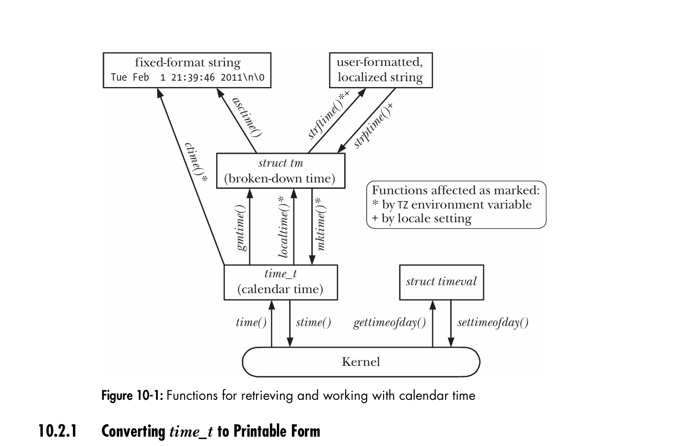

#+TITLE: Time
#+AUTHOR: Astar Bahouidi
#+DESCRIPTION: Section 10 of "The Linux Programming Interface" by Michael Kerrisk
#+STARTUP: showall

* Table Of Contents                                                   :toc_3:
- [[#time-definition][Time Definition]]
- [[#101-calendar-time][10.1 Calendar Time]]
  - [[#the-gettimeofday-system-call][The =gettimeofday()= system call]]
  - [[#the-legacy-time-now-redundant][The legacy =time()= now redundant]]
- [[#102-time-conversion-functions][10.2 Time-Conversion Functions]]
  - [[#1021-converting-time_t-to-printable-form][10.2.1 Converting =time_t= to Printable Form]]
  - [[#1022-converting-between-time_t-and-broken-down-time][10.2.2 Converting Between =time_t= and Broken-Down Time]]
    - [[#get-broken-down-time-from-time_t][Get broken-down time from =time_t=]]
    - [[#set-time_t-from-broken-down-time][Set =time_t= from broken-down time]]
  - [[#1023-converting-between-broken-down-time-and-printable-form][10.2.3 Converting Between Broken-Down Time and Printable Form]]
    - [[#broken-down-time-to-default-printable-form][Broken-Down Time to Default Printable Form]]
    - [[#broken-down-time-to-highly-customizable-string][Broken-Down Time to Highly Customizable String]]
    - [[#from-printable-form-to-broken-down-time][From printable form to broken-down time]]
- [[#103-timezones][10.3 Timezones]]
  - [[#timezone-definition][Timezone definition]]
  - [[#specifying-the-timezone-for-a-program][Specifying the timezone for a program]]
- [[#104-locales][10.4 Locales]]
  - [[#locale-definition][Locale definition]]
  - [[#locale-categories][Locale Categories]]
  - [[#specifying-the-locale-for-a-program][Specifying the locale for a program]]
  - [[#locale-study-case][Locale Study Case]]
    - [[#test-command-specific-localization][Test command-specific localization]]
    - [[#the-compilation-pipeline-of-locale-generation][The Compilation Pipeline Of Locale Generation]]
- [[#105-updating-the-system-wall-clock][10.5 Updating the System Wall Clock]]
- [[#106-the-software-clock-jiffies][10.6 The Software Clock: Jiffies]]
- [[#107-process-time][10.7 Process Time]]
  - [[#the-times-system-call][The =times()= system call]]
  - [[#getting-total-cpu-time-with-clock][Getting Total CPU Time with =clock()=]]
  - [[#example-program][Example Program]]
- [[#109-exercise][10.9 Exercise]]
  - [[#exercise-101][Exercise 10.1]]
    - [[#answer][Answer]]
    - [[#critical-system-takeaway][Critical System Takeaway]]

* Time Definition

Within a program, we may be interested in two kinds of time:

A. *Real time*: This is the natural time flow also know as “wall clock”.
   It has different interest based on the stand point it is measured
   from:
   a. *From the calendar*: useful to database timestamps and file system
      records.
   b. *Measuring elapsed time from arbitrary point*: useful to
      applications that take periodic actions or make regular
      measurements from some external input device.

B. *Process time*: This is the amount of CPU time used by a process.
   - Measuring process time is useful for checking or optimizing the
     performance of a program or algorithm.

* 10.1 Calendar Time

** The =gettimeofday()= system call

#+begin_src c
  #include <sys/time.h>

  int gettimeofday(struct timeval *tv, struct timezone *tz);
  /* Returns 0 on success, or –1 on error */
#+end_src

The tv argument is a pointer to a structure of the following form:

#+begin_src c
  struct timeval {
    time_t tv_sec;       /* Seconds since 00:00:00, 1 Jan 1970 UTC */
    suseconds_t tv_usec; /* Additional microseconds (long int) */
  };

#+end_src

Although the =tv_usec= field affords microsecond precision, the
accuracy of the value it returns is determined by the
architecture-dependent implementation. (The u in =tv_usec= derives
from the resemblance to the Greek letter μ (“mu”) used in the metric
system to denote one-millionth.) On modern x86-32 systems (i.e.,
Pentium systems with a Timestamp Counter register that is incremented
once at each CPU clock cycle), =gettimeofday()= does provide
microsecond accuracy.

The =tz= argument to =gettimeofday()= is a historical artifact. In
older UNIX implementations, it was used to retrieve timezone
information for the system. *This argument is now obsolete and should
always be specified as =NULL=.*

** The legacy =time()= now redundant

The =time()= system call returns the number of seconds since the Epoch
(i.e., the same value that =gettimeofday()= returns in the =tv_sec=
field of its =tv= argument).

#+begin_src c
  #include <time.h>
  time_t time(time_t *timep);
  /* Returns number of seconds since the Epoch,or (time_t) –1 on error */
#+end_src

Since =time()= *returns the same value in two ways*, and the only
possible error that can occur when using =time()= is *to give an
invalid address in the =timep= argument* (=EFAULT=), we often simply
use the following call (without error checking):

#+begin_src c
t = time(NULL);
#+end_src

The existence of =time()= as a system call is now redundant; *it could
be implemented as a library function that calls =gettimeofday()=.*

* 10.2 Time-Conversion Functions

- : Functions for retrieving and working with calendar time.

** 10.2.1 Converting =time_t= to Printable Form

#+begin_src c
  #include <time.h>
  char *ctime(const time_t *timep);
  /* Returns pointer to statically allocated string terminated by
     newline and \0 on success, or NULL on error */
#+end_src

Given a pointer to a =time_t= value in =timep=, =ctime()= returns a
*26-byte string* containing the date and time accounting for time zone
and DST settings in a standard format, as illustrated:

#+begin_example
Wed Jun 8 14:22:34 2011
#+end_example

*SUSv3* states that calls to any of the functions =ctime()=,
 =gmtime()=, =localtime()=, or =asctime()= may overwrite the
 statically allocated structure that is returned by any of the other
 functions. In other words, these functions *may share single copies
 of the returned character array and =tm= structure*, and this is done
 in some versions of glibc. If we need to maintain the returned
 information across multiple calls to these functions, we must save
 local copies.

They all have reentrant versions: =ctime_r()=, =gmtime_r()=,
=localtime_r()= and =asctime_r()=.

** 10.2.2 Converting Between =time_t= and Broken-Down Time

*** Get broken-down time from =time_t=

The =gmtime()= and =localtime()= functions convert a =time_t= value
into a so-called *broken-down time*. The broken-down time is placed in
a *statically allocated structure* whose address is returned as the
function result.

#+begin_src c
  #include <time.h>
  struct tm *gmtime(const time_t *timep);
  struct tm *localtime(const time_t *timep);
  /* Both return a pointer to a statically allocated broken-down time
     structure on success, or NULL on error */

  /* The tm structure returned by these functions contains the date and
     time fields broken into individual parts */

  struct tm {
    int tm_sec;   /* Seconds (0-60) */
    int tm_min;   /* Minutes (0-59) */
    int tm_hour;  /* Hours (0-23) */
    int tm_mday;  /* Day of the month (1-31) */
    int tm_mon;   /* Month (0-11) */
    int tm_year;  /* Year since 1900 */
    int tm_wday;  /* Day of the week (Sunday = 0) */
    int tm_yday;  /* Day in the year (0-365; 1 Jan = 0) */
    int tm_isdst; /* Daylight saving time flag
                     > 0: DST is in effect;
                     = 0: DST is not effect;
                     < 0: DST information not available */
  };

#+end_src

The =gmtime()= function converts a calendar time into a broken-down
time corresponding to UTC. (The letters gm derive from Greenwich Mean
Time.) By contrast, =localtime()= takes into account timezone and DST
settings to return *a broken-down time corresponding to the system’s
local time*.

In the =tm= structure the =tm_sec= field can be up to 60 (rather
than 59) to account for the leap seconds that are occasionally applied
to adjust human calendars to the astronomically exact (the so-called
tropical) year.

*** Set =time_t= from broken-down time

The =mktime()= function *translates a broken-down time*, expressed as
*local time*, into the =time_t= returned value. The caller supplies
the broken-down time in a =tm= structure pointed to by
=timeptr=. During this translation, the =tm_wday= and =tm_yday= fields
of the input =tm= structure are ignored.

#+begin_src c
  #include <time.h>
  time_t mktime(struct tm *timeptr);
  /* Returns seconds since the Epoch corresponding to timeptr on
     success, or (time_t) –1 on error */
#+end_src

This function may modify the supplied argument. In that respect this
function comes really handy because it performs all necessary
balancing arithmetic in the =tm= fields whether their values are
negative or positive overflow (overflowing the bounds of their time
numbers representations). Only then will it set =tm_wday= and
=tm_yday= fields. Additionally, it sets the =tm_isdst= field as
followed:

- *If =tm_isdst= is 0*, treat this time as standard time (i.e., ignore
  DST, even if it would be in effect at this time of year).
- *If =tm_isdst= is greater than 0*, treat this time as DST (i.e.,
  behave as though DST is in effect, even if it would not normally be
  so at this time of year).
- *If =tm_isdst= is less than 0*, attempt to determine if DST would be
  in effect at this time of the year. *This is typically the setting
  we want*.

On completion (and regardless of the initial setting of =tm_isdst=),
=mktime()= sets the =tm_isdst= field to a positive value if DST is in
effect at the given date, or to 0 if DST is not in effect.

** 10.2.3 Converting Between Broken-Down Time and Printable Form

*** Broken-Down Time to Default Printable Form

#+begin_src c
  #include <time.h>
  char *asctime(const struct tm *timeptr);
  /* Returns pointer to statically allocated string terminated by
     newline and \0 (exactly the same format as returned by ctime). On
     success, or NULL on error */
#+end_src

By contrast with =ctime()=, local timezone settings have no effect on
=asctime()=, since it is converting a broken-down time that is
typically either already localized via =localtime()= or in UTC as
returned by =gmtime()=. As with =ctime()=, we have no control over the
format of the string produced by =asctime()=.

- [[file:calendar_time.c][Listing 10.1 calendar_time.c]] : Retrieving and converting calendar times

*** Broken-Down Time to Highly Customizable String

#+begin_src c
  #include <time.h>
  size_t strftime(char *outstr, size_t maxsize, const char *format,
                  const struct tm *timeptr);
  /* Returns number of bytes placed in outstr (excluding terminating
     null byte) on success, or 0 on error */
#+end_src

The string returned in =outstr= is formatted according to the
specification in =format=.  The =maxsize= argument specifies the
maximum space available in =outstr=.  Unlike =ctime()= and
=asctime()=, =strftime()= doesn’t include a newline character at the
end of the string (*unless one is included in format*).

On success, =strftime()= *returns the number of bytes placed in
=outstr=,* excluding the terminating null byte.  If the total length
of the resulting string, including the terminating null byte, would
exceed =maxsize= bytes, then =strftime()= *returns 0* to indicate an
error, and the contents of =outstr= are indeterminate.

- [[file:curr_time.c][Listing 10.2 curr_time.c]]: Utility function for TLPI custom library.

**** Table 10-1
:PROPERTIES:
:CUSTOM_ID: table-10-1
:END:

Selected conversion specifiers for =strftime()= (Refer to [[shell:man 3 strftime][strftime(3)]]
for rich format specifiers):

| Specifier | Description                         | Example                   |
|           |                                     | <l>                       |
|-----------+-------------------------------------+---------------------------|
| %%        | A % character                       | "%"                       |
| %a        | Abbreviated weekday name            | "Tue"                     |
| %A        | Full weekday name                   | "Tuesday"                 |
| %b, %h    | Abbreviated month name              | "Feb"                     |
| %B        | Full month name                     | "February"                |
| %c        | Date and time                       | "Tue Feb 1 21:39:46 2011" |
| %d        | Day of month (2 digits, 01 to 31)   | "01"                      |
| %D        | American date (same as %m/%d/%y)    | "02/01/11"                |
| %e        | Day of month (2 characters)         | " 1"                      |
| %F        | ISO date (same as %Y-%m-%d)         | "2011-02-01"              |
| %H        | Hour (24-hour clock, 2 digits)      | "21"                      |
| %I        | Hour (12-hour clock, 2 digits)      | "09"                      |
| %j        | Day of year (3 digits, 001 to 366)  | "032"                     |
| %m        | Decimal month (2 digits, 01 to 12)  | "02"                      |
| %M        | Minute (2 digits)                   | "39"                      |
| %p        | AM/PM                               | "PM"                      |
| %P        | am/pm (GNU extension)               | "pm"                      |
| %R        | 24-hour time (same as %H:%M)        | "21:39"                   |
| %S        | Second (00 to 60)                   | "46"                      |
| %T        | Time (same as %H:%M:%S)             | "21:39:46"                |
| %u        | Weekday number (1 to 7, Monday = 1) | "2"                       |
| %U        | Sunday week number (00 to 53)       | "05"                      |
| %w        | Weekday number (0 to 6, Sunday = 0) | "2"                       |
| %W        | Monday week number (00 to 53)       | "05"                      |
| %x        | Date (localized)                    | "02/01/11"                |
| %X        | Time (localized)                    | "21:39:46"                |
| %y        | 2-digit year                        | "11"                      |
| %Y        | 4-digit year                        | "2011"                    |
| %Z        | Timezone name                       | "CET"                     |

*** From printable form to broken-down time

The =strptime()= function work on the model of =scanf()=. It needs the
user defined input string to interpret (=str= argument); the format
string of conversion specifiers for how to interpret =str= (=format=
argument=); and the =timeptr=, a =struct tm= to dump the result of the
conversion. The return value is a pointer in the =str= string to the
first unprocessed character. This pointer comes handy to know about
further informations to process.

#+begin_src c
  #define _XOPEN_SOURCE
  #include <time.h>
  char *strptime(const char *str, const char *format, struct tm *timeptr);
  /* Returns pointer to next unprocessed character in str on success, or
     NULL on error */
#+end_src

Note that =strptime()= never sets the value of the =tm_isdst= field of
the =tm= structure.

- [[file:strtime.c][Listing 10.3 strtime.c]]: demonstrates the use of =strptime()= and
  =strftime()= by retrieving and converting calendar times. (We
  describe the =setlocale()= function used in this program in Section
  10.4.)

The following shell session log shows some examples of the use of this
program:

#+begin_example
$ ./strtime "9:39:46pm 1 Feb 2011" "%I:%M:%S%p %d %b %Y"
calendar time (seconds since Epoch): 1296592786
strftime() yields: 21:39:46 Tuesday, 01 February 2011 CET
#+end_example

The following usage is similar, but this time we explicitly specify a
format for =strftime()=:

#+begin_example
$ ./strtime "9:39:46pm 1 Feb 2011" "%I:%M:%S%p %d %b %Y" "%F %T"
calendar time (seconds since Epoch): 1296592786
strftime() yields: 2011-02-01 21:39:46
#+end_example

* 10.3 Timezones

** Timezone definition

Because timezones informations are voluminous and volatile they are
not encoded into programs or libraries but rather maintained as files
in standard format by the system. The files reside in the directory
=/usr/share/zoneinfo= that holds file named after the timezone they
describe (e.g., EST (US Eastern Standard Time), CET (Central European
Time)); and subdirectories of same format files hierarchically
grouping related timezones like Auckland, Port_Moresby, and
Galapagos. When we specify a timezone for use by a program, in effect,
*we are specifying a relative pathname for one of the timezone files
in this directory*.

The local time for the system is defined by the timezone file
=/etc/localtime=, which is often linked to one of the files in
=/usr/share/zoneinfo=.

The format of timezone files is documented in the =tzfile(5)= manual
page. Timezone files are built using =zic(8)=, the zone information
compiler. The =zdump(8)= command can be used to display the time as it
would be currently according to the timezone in a specified timezone
file.

** Specifying the timezone for a program

To specify a timezone when running a program, we set the =TZ=
environment variable to a string consisting of a colon (:) followed by
one of the timezone names defined in =/usr/share/zoneinfo= (Linux and
some other UNIX implementations permit the colon to be omitted when
using this form, but *SUSv3* doesn’t specify this; for portability,
*we should always include the colon*.)

Setting the timezone automatically influences the functions =ctime()=,
=localtime()=, =mktime()=, and =strftime()=.  To obtain the current
timezone setting, each of these functions uses =tzset(3)=, which
initializes three global variables:

#+begin_src c
  char *tzname[2]; /* Name of timezone and alternate (DST) timezone */
  int daylight;    /* Nonzero if there is an alternate (DST) timezone */
  long timezone;   /* Seconds difference between UTC and local standard
                      time */
#+end_src

The =tzset()= function first checks the =TZ= environment variable. If
this variable is not set, then the timezone is initialized to the
default defined in the timezone file =/etc/localtime=. If the =TZ=
environment variable is defined with a value that can’t be matched to
a timezone file, or it is an empty string, then UTC is used.

We can see the effect of the =TZ= variable by running the program in
[[file:show_time.c][Listing 10.4 show_time.c]].

#+begin_example
$ ./show_time
ctime() of time() value is: Tue Feb 1 10:25:56 2011
asctime() of local time is: Tue Feb 1 10:25:56 2011
strftime() of local time is: Tuesday, 01 Feb 2011, 10:25:56 CET

$ TZ=":Pacific/Auckland" ./show_time
ctime() of time() value is: Tue Feb 1 22:26:19 2011
asctime() of local time is: Tue Feb 1 22:26:19 2011
strftime() of local time is: Tuesday, 01 February 2011, 22:26:19 NZDT
#+end_example

* 10.4 Locales

To set locale and other useful info see =man locale(1)= and its
references list, =man locale.aliases(5)=.

** Locale definition

*SUSv3* defines a locale as the “subset of a user’s environment that
depends on language and cultural conventions.”  Locale information is
maintained in a directory hierarchy under =/usr/{share,lib}/locale=.
Each subdirectory under these directories contains information about a
particular locale.  These directories are named using the following
convention:

#+begin_example
language[_territory[.codeset]][@modifier]
#+end_example

In the case of =/usr/lib/locale/locale-archive= those specifically
named subdirectories are bundled into the archive when they are
compiled.

** TODO Locale Categories

** Specifying the locale for a program

The =setlocale()= function is used to both set and query a program’s
current locale:

#+begin_src c
  #include <locale.h>
  char *setlocale(int category, const char *locale);
  /* Returns pointer to a (usually statically allocated) string
     identifying the new or current locale on success, or NULL on
     error */
#+end_src

** Locale Study Case

*** Test command-specific localization

Locale settings control the operation of a wide range of GNU/Linux
utilities, as well as many functions in glibc. Among these are the
functions =strftime()= and =strptime()= (Section 10.2.3), as shown by
the results from =strftime()= when we run the program in [[file:show_time.c][Listing 10.4
show_time.c]] in a number of different locales:

#+begin_src sh
$ LC_ALL=es_ES ./show_time
ERROR [ENOENT No such file or directory] setlocale
#+end_src

passing the identifier =es_ES= to tell =setlocale(LC_ALL, "")= to
look up the Spanish localization data.

When your system throws =ENOENT= (Error: No such file or directory),
it doesn't mean your C code is broken, and it doesn't mean the
directory names in =/usr/share/locale/= are wrong. It means *your
Linux distribution hasn't compiled and generated the actual locale
definitions* for that specific language.

**** The Root Cause: Why =/usr/share/locale/es= Isn't Enough
:PROPERTIES:
:CUSTOM_ID: the-root-cause-why-usrsharelocalees-isnt-enough
:END:
Modern locales are huge and scale to dozens of MiB. Consequently,
modern Linux distributions (especially Ubuntu, Debian, Arch, and
Fedora) strip these compiled locales out of the default installation
to save hundreds of megabytes of disk space. Only your currently
selected system language (usually something like =en_US.UTF-8= or
=C.UTF-8=) is compiled by default.

You might look inside =/usr/share/locale/= and see directories like
=es=, =fr=, or =de= and think, /"They are right there!"/ However,
=setlocale()= does not look at those raw translation directories
directly.  Instead, GNU =libc= (glibc) *expects a fully compiled,
optimized locale database binary*, typically located at
=/usr/lib/locale/locale-archive= or inside a specific subtype
directory matching the complete string format:
=language_REGION.encoding= (e.g., =es_ES.UTF-8=).

**** Find out what locales are /actually/ compiled
:PROPERTIES:
:CUSTOM_ID: find-out-what-locales-are-actually-compiled
:END:
Run this in your terminal:

#+begin_src sh
locale -a
#+end_src

This will print a small list of valid, active strings.  Any string
*not* in this list will cause =setlocale()= to throw =ENOENT=
immediately.  You can even trace their origin with =locale -av=: this
will display a formatted table of all compiled locale with all the
informations in their =LC_IDENTIFICATION= category.

*** The Compilation Pipeline Of Locale Generation

Here is the complete, end-to-end trace of how a locale goes from a raw
text definition in the system files to a highly optimized, usable binary
block inside your =locale-archive=.

#+begin_src text
[1. Source Text files]
/usr/share/i18n/locales/es_ES
/usr/share/i18n/charmaps/UTF-8.gz

[2. The Compiler]
localedef

[3. The Unified Archive]
/usr/lib/locale/locale-archive
#+end_src

**** 1. The Source Text Components (The Inputs)
:PROPERTIES:
:CUSTOM_ID: the-source-text-components-the-inputs
:END:
Before anything is compiled, the configuration files live in two
distinct plain-text source directories (/i18n/ stands for
/internationalization/ as i + 18 chars + n):

- *The Cultural Definitions (=/usr/share/i18n/locales/=):* Contains
  the human-readable text definitions for languages (e.g., =es_ES=,
  =fr_FR=). These files define day names, currency formats, and text
  strings.
- *The Character Maps (=/usr/share/i18n/charmaps/=):* Contains the
  text mappings for character sets (e.g., =UTF-8.gz=). This acts as
  the codec translation key.

*Note on TLPI's =/usr/share/locale/=:* This directory is actually used
for *application-level* translation strings (managed by =gettext=,
containing compiled =.mo= translation catalogs). *It is /not/ where
the core libc system locale configuration data is generated from!*

**** 2. The Compilation Engine Path
:PROPERTIES:
:CUSTOM_ID: the-compilation-engine-path
:END:
When you invoke the compiler tool (=localedef=), it reads both text
inputs simultaneously.  It cross-references the language behavior file
with the character mapping file to calculate exact, machine-native
binary hashes and memory-aligned structures.

--------------

**** 3. The Commands to Populate the Archive
:PROPERTIES:
:CUSTOM_ID: the-commands-to-populate-the-archive
:END:
Depending on whether you want to inject a single language or rebuild
your entire environment layout, you use the following =glibc=
utilities:

***** Option A: Target a Single Specific Locale
:PROPERTIES:
:CUSTOM_ID: option-a-target-a-single-specific-locale
:END:
To compile and append a precise combination into the archive file:

#+begin_src sh
sudo localedef -i es_ES -f UTF-8 es_ES.UTF-8
#+end_src

- =-i es_ES=: The input source definition path.  Go and take a look at
  the plain-text right at =/usr/share/i18n/locales/es_ES=.
- =-f UTF-8=: The input character map codec to apply. The archive
  plain-text is right at =/usr/share/i18n/charmaps/UTF-8.gz=.
- =es_ES.UTF-8=: The logical identity name this block will receive
  inside the archive database.

***** Option B: Mass Batch Compilation
:PROPERTIES:
:CUSTOM_ID: option-b-mass-batch-compilation
:END:
On distributions like Debian or Ubuntu, instead of calling the
compiler directly, you use a wrapper script that processes a config
file (=/etc/locale.gen=) listing your choices:

#+begin_src sh
sudo $EDITOR /etc/locale.gen
#+end_src

Uncomment the lines for the languages you want to test (remove the =#=):

#+begin_src text
es_ES.UTF-8 UTF-8
fr_FR.UTF-8 UTF-8
#+end_src

Save the file, and then compile them by running:

#+begin_src sh
sudo locale-gen
#+end_src

This utility automatically loops over every uncommented line in the
config file, runs =localedef= for each pair behind the scenes, and
packs them into the target database file.

**** Check The Main Archive (Where all compiled locales actually live)

On almost all modern Linux distributions (Ubuntu, Debian, Fedora,
Arch), *compiled locales do not get their own independent directories
anymore*. Instead, they are packed into a single, massive binary file
called the =locale-archive= usually at =/usr/lib/locale/=.  Once the
compilation pass finishes, the binary block is immediately written to
disk inside the huge archive.  This file is typically anywhere from
*50 MB to 100+ MB*.

You verify that the entry is now present, usable, and mapped into
memory by running your inventory command: =localedef --list-archive=.
That command lists all compiled locales inside the archive.

The next time any C binary executes =setlocale(LC_ALL,
"es_ES.UTF-8")=, the GNU C Library utilizes =mmap()= to map this
single binary file directly into your process's virtual memory
space. It then uses internal offsets to jump straight to the Spanish
translation strings and formatting rules. This time, your runtime code
works flawlessly!

* TODO 10.5 Updating the System Wall Clock

* 10.6 The Software Clock: Jiffies

The accuracy of various time-related system calls described in this
book is limited to the resolution of the system *software clock*,
which measures time in units called *jiffies*.  The size of a *jiffy*
is defined by the constant =HZ= within the kernel source code.  This
is the *unit in which the kernel allocates the CPU to processes under
the roundrobin time-sharing scheduling algorithm* (Section 35.1).

On Linux/x86-32 in kernel versions up to and including 2.4, the *rate
of the /software clock/ was 100 hertz* (not the CPU rate); that is, a
*jiffy is 10 milliseconds*.

Because CPU speeds have greatly increased since Linux was first
implemented, in kernel 2.6.0, the *rate of the /software clock/ was
raised to 1000 hertz* on Linux/ x86-32.

Since kernel 2.6.13, the clock rate can be set to 100, 250 (the
default), or 1000 hertz, giving jiffy values of 10, 4, and 1
milliseconds, respectively.  Since kernel 2.6.20, a further frequency
is available: 300 hertz, a number that divides evenly for two common
video frame rates: 25 frames per second (PAL) and 30 frames per second
(NTSC).

* 10.7 Process Time

Process time is the amount of CPU time used by a process since it was
created. For recording purposes, the kernel separates CPU time into
the following two components:

- *User CPU time* is the amount of time spent executing in user
  mode. Sometimes referred to as virtual time, this is the time that
  it appears to the program that it has access to the CPU.

- *System CPU time* is amount of time spent executing in kernel
  mode. This is the time that the kernel spends executing system calls
  or performing other tasks on behalf of the program (e.g., servicing
  page faults).

Sometimes, we refer to process time as the *total CPU time* consumed
by the process.

When we run a program from the shell, we can use the =time(1)= command
to obtain both process time values, as well as the real time required
to run the program:

#+begin_example
$ time ./myprog
real 0m4.84s
user 0m1.030s
sys 0m3.43s
#+end_example

** TODO The =times()= system call

#+begin_src c
    #include <sys/times.h>

    clock_t times(struct tms *buf);
    /* Returns number of clock ticks (sysconf(_SC_CLK_TCK)) since
       “arbitrary” time in past on success, or (clock_t) –1 on error */

    /* This tms structure pointed to by buf has the following form: */

    struct tms {
      clock_t tms_utime; /* User CPU time used by caller */
      clock_t tms_stime; /* System CPU time used by caller */
      clock_t tms_cutime; /* User CPU time of all (waited for) children */
      clock_t tms_cstime; /* System CPU time of all (waited for) children */
    };

#+end_src

On success, all fields in =buf= are populated with *zero-based* valued
from the *start of the calling process*. However, =times()= returns
the elapsed (real) time in clock ticks since some arbitrary point in
the past. *SUSv3* deliberately does not specify what this point is,
merely stating that it will be constant during the life of the calling
process. *Therefore, the only portable use of this return value is to
measure elapsed time in the execution of the process* by calculating
the difference in the value returned by pairs of =times()=
calls. However, even for this use, the return value of =times()= is
unreliable, since it can overflow the range of clock_t, at which point
the value would cycle to start again at 0 (i.e., a later =times()=
call could return a number that is lower than an earlier =times()=
call). The reliable way to measure the passage of elapsed time is to
use =gettimeofday()=.

** Getting Total CPU Time with =clock()=

The =clock()= function provides a simpler interface for retrieving the
total (i.e., user plus system) CPU time used by the calling process.

Internally =clock()= calls =times()= and sum up =tms.tms_utime= and
=tms.tms_stime=.

#+begin_src c
  #include <time.h>
  clock_t clock(void);
  /* Returns total CPU time used by calling process measured in
     CLOCKS_PER_SEC, or (clock_t) –1 on error */
#+end_src

The value returned by =clock()= is measured in units of
=CLOCKS_PER_SEC=, so we must divide by this value to arrive at the
number of seconds of CPU time used by the process.  =CLOCKS_PER_SEC=
is fixed at 1 million by POSIX.1, regardless of the resolution of the
underlying software clock (Section 10.6). The accuracy of =clock()= is
nevertheless limited to the resolution of the software clock.

Although the =clock_t= return type of =clock()= is the same data type
that is used in the =times()= call, the *units of measurement employed
by these two interfaces are different*. This is the result of
historically conflicting definitions of clock_t in POSIX.1 and the C
programming language standard.

Even though =CLOCKS_PER_SEC= is fixed at *1 million*, SUSv3 notes that
this constant could be an integer variable on non-XSI-conformant
systems, so that *we can’t portably treat it as a compile-time
constant* (i.e., we can’t use it in #ifdef preprocessor expressions).
Because it may be defined as a long integer (i.e., 1000000L), we
always cast this constant to long so that we can portably print it
with =printf()= (see Section 3.6.2).

SUSv3 states that =clock()= should return “the processor time used by
the process.”  This is open to different interpretations. On some UNIX
implementations, the time returned by =clock()= includes the CPU time
used by all waited-for children.  *On Linux, it does not*.

** Example Program

- [[file:process_time.c][Listing 10.5 process_time.c]]: Retrieving process CPU times. Notice
  that over multiple processes (running the program again) the return
  value from =times()= keeps increasing while its fields steadily
  reflect process *CPU times*.

* 10.9 Exercise

** Exercise 10.1

Assume a system where the value returned by the call
=sysconf(_SC_CLK_TCK)= is 100. Assuming that the =clock_t= value
returned by =times()= is an unsigned /32-bit/ integer, how long will
it take before this value cycles so that it restarts at /0/? Perform
the same calculation for the =CLOCKS_PER_SEC= value returned by
=clock()=.

*** Answer

**** Part 1: The =times()= Cycle Calculation

The =times()= system call returns time measured in *Clock Ticks* (user
clock ticks).

An unsigned 32-bit integer (=uint32_t=) can hold a maximum value of
src_tex{\(2^{32} - 1\)}. The total number of unique positions before
it overflows and cycles back to src_tex{\(0\)} is exactly:

#+begin_src tex
\[2^{32} = 4,294,967,296 \text{ ticks}\]
#+end_src

The problem states that =sysconf(_SC_CLK_TCK)= returns =100=. This means
the counter increments *100 times every second*.

#+begin_src tex
  \[\text{Seconds} = \frac{4,294,967,296}{100} = 42,949,672.96 \text{ seconds}\]

  %% Now, convert those seconds into days to make the number human-readable:

  \[\text{Minutes} = \frac{42,949,672.96}{60} \approx 715,827.88\]

  \[\text{Hours} = \frac{715,827.88}{60} \approx 11,930.46\]

  \[\text{Days} = \frac{11,930.46}{24} \approx \mathbf{497.10 \text{ days}}\]
#+end_src

It will take approximately *497 days* (about 1 year and 4.5 months) of
continuous system uptime for the =times()= return value to cycle back
to zero.

**** Part 2: The =clock()= Cycle Calculation

On standard POSIX/Linux systems, =CLOCKS_PER_SEC= is strictly defined
as *1,000,000* (1 million). This means the counter increments
*1,000,000 times every second* (counting in microseconds).

#+begin_src tex
  \[\text{Seconds} = \frac{4,294,967,296}{1,000,000} \approx 4,294.97 \text{ seconds}\]

  %% Now, convert those seconds into a readable timeframe:

  \[\text{Minutes} = \frac{4,294.97}{60} \approx \mathbf{71.58 \text{ minutes}}\]
#+end_src

It will take only *71.58 minutes* (1 hour, 11 minutes, and 35 seconds)
of continuous CPU usage for the =clock()= return value to overflow and
cycle back to zero!

**** Summary for Your Record

| Function  | Unit Increment Speed  | Math Equation          | Time Until Overflow / Cycle |
|-----------+-----------------------+------------------------+-----------------------------|
| =times()= | 100 ticks / sec       | \(2^{32} / 100\)       | ~497.10 Days                |
| =clock()= | 1,000,000 ticks / sec | \(2^{32} / 1,000,000\) | ~71.58 Minutes              |

*** Critical System Takeaway

This exercise highlights why =clock()= is notoriously dangerous to use
for long-running performance profiling on 32-bit systems (or when using
32-bit storage containers). If your benchmarked program runs for just an
hour and a half, =clock()= will roll over, and computing
=end_time - start_time= will yield a completely corrupt negative or
inverted result unless you explicitly handle the overflow wrapper logic!

